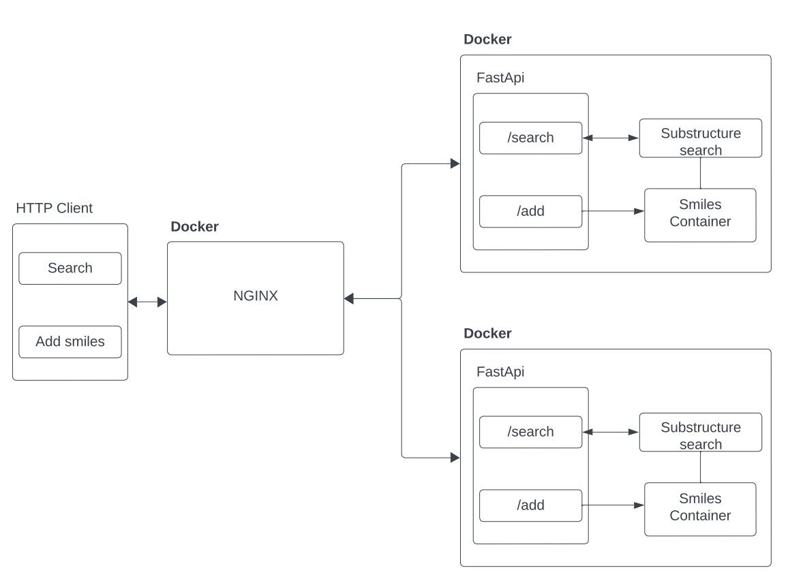
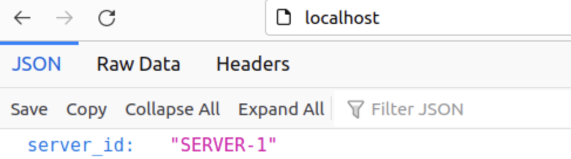
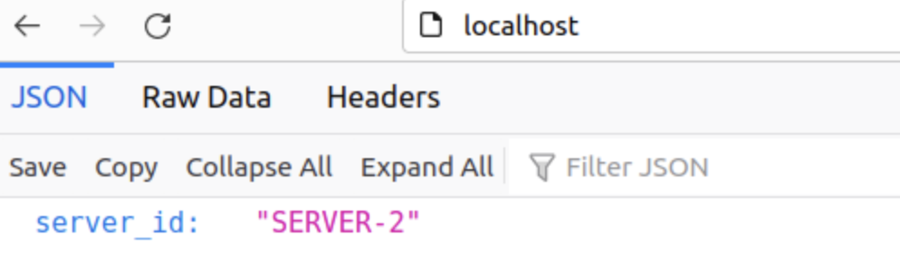

# Homework 6
## Building with Docker

We got to know the Docker during the lectures. Lets dockerize a web application.
Try to use the best practices that were discussed during the lesson.


It is necessary to implement Dockerfile and docker compose for your Python FastAPI application with installed rdkit.
Use this to install rdkit:

```dockerfile
FROM continuumio/miniconda3
RUN conda install conda-forge::rdkit
```

Don't forget to create a new branch and make a pull request. 
Reviewers is [Kirill Saltanov](https://github.com/Saltanofff)

## **[Optional]** Load balancer

This part will give you extra points for completing it. We will use nginx for load balancing.



- Add method to check balancing:
```python
@app.get("/")
def get_server():
    return {"server_id": getenv("SERVER_ID", "1")}
```

- Configuration file for nginx **nginx/default.conf**:

```commandline
upstream webapp {
    server web1:8000;
    server web2:8000;
}

server {
    listen 80;

    location / {
        proxy_pass http://webapp;
    }
}
```

- Define services, networks, and volumes in `docker-compose.yml`.
```dockerfile
version: '3.8'
services:
  web1:
    build: ./src
    volumes:
      - ./src:/src
    environment:
      SERVER_ID: SERVER-1

  web2:
    build: ./src
    volumes:
      - ./src:/src
    environment:
      SERVER_ID: SERVER-2
      
  nginx:
    image: nginx:latest
    ports:
      - "80:80"
    volumes:
      - ./nginx:/etc/nginx/conf.d
    depends_on:
      - web1
      - web2
```

- Run the following to build and start the application:

` docker-compose up --build -d`

- View the running containers:

`docker-compose ps`

- You should be able to access the application on your browser.



- Refresh to confirm that the load balancer distributes the request to both web containers.

