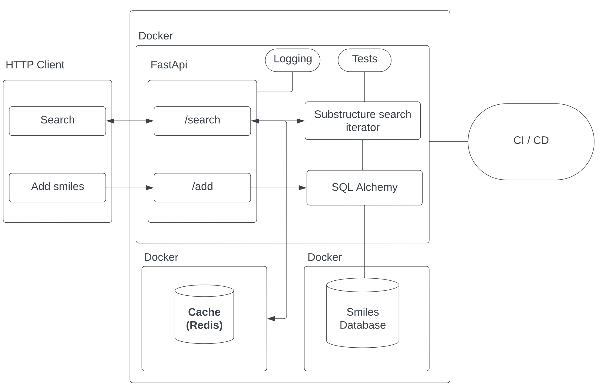

# Homework 10

## Redis



### Overview of Redis

**Redis** (Remote Dictionary Server) is an open-source, in-memory data structure store that can be used as a database, cache, and message broker. Redis is well-known for its high performance, providing extremely fast access to data by keeping it in memory. It supports various data structures like strings, lists, sets, and hashes, making it versatile for different use cases. Commonly, Redis is used for caching, which helps reduce the load on the main database and speeds up the application by storing frequently accessed data in memory.

### Why Use Redis?

Redis is particularly beneficial in scenarios where you need to store and retrieve data quickly. It can be used to cache the results of expensive database queries, improving the performance of your application by reducing latency and the number of requests hitting your primary database.

Key benefits of using Redis include:
- **Caching**: Store frequently accessed data in memory to reduce the load on your primary database and improve application performance.
- **High Performance**: Redis operates entirely in-memory, providing extremely fast data access.
- **Scalability**: Redis can handle large amounts of data with minimal latency, making it suitable for high-traffic applications.
- **Versatility**: Redis supports a variety of data structures, enabling a wide range of use cases beyond simple caching, such as session management, real-time analytics, and leaderboards.

### Integrating Redis with FastAPI

Integrating Redis with a FastAPI project using Docker and Docker Compose allows you to easily manage and deploy your services in isolated containers, ensuring consistency across different environments.

#### 1. Set Up Docker Compose

Next, create a `docker-compose.yml` file to define your FastAPI service and the Redis service:

```yaml
version: '3'

services:
  web:
    build: .
    command: uvicorn main:app --host 0.0.0.0 --port 8000
    volumes:
      - .:/app
    ports:
      - "8000:8000"
    depends_on:
      - redis

  redis:
    image: "redis:alpine"
    ports:
      - "6379:6379"
```

This configuration defines two services:
- **web**: The FastAPI application, which will be built from the `Dockerfile` and served using Uvicorn.
- **redis**: The Redis service, which uses the official Redis Docker image.

#### 2. Use Redis in Your FastAPI Application

Now, integrate Redis into your FastAPI application. Below is an example of how you can use Redis for caching search results.

Create a `main.py` file for your FastAPI application:

```python
from fastapi import FastAPI
import redis
import json

app = FastAPI()

# Connect to Redis
redis_client = redis.Redis(host='redis', port=6379, db=0)

def get_cached_result(key: str):
    result = redis_client.get(key)
    if result:
        return json.loads(result)
    return None

def set_cache(key: str, value: dict, expiration: int = 60):
    redis_client.setex(key, expiration, json.dumps(value))

@app.get("/search/")
async def search(query: str):
    cache_key = f"search:{query}"
    cached_result = get_cached_result(cache_key)
    
    if cached_result:
        return {"source": "cache", "data": cached_result}

    # Simulate a search operation (e.g., querying a database)
    search_result = {"query": query, "result": "Some data"}  # Replace with actual search logic

    set_cache(cache_key, search_result)
    
    return {"source": "database", "data": search_result}
```

In this example, the search endpoint first checks if the result is cached in Redis. If it is, the cached data is returned. If not, the search is performed, and the result is cached for future requests.

#### 3. Running the Application

To start the application with Redis, simply run:

```bash
docker-compose up --build
```

This command will build your FastAPI service, start the Redis container, and make both services available. Your FastAPI application will be available at `http://localhost:8000`, and Redis will be running on port 6379.

### Homework Assignment

**Objective**: Modify the search functionality in your FastAPI project to use Redis for caching search results.

**Instructions**:
1. **Set Up Docker and Redis**:
   - Ensure that Redis is integrated into your FastAPI project using Docker and Docker Compose as described above.

2. **Implement Caching**:
   - Modify the search logic in your FastAPI application to check for cached results in Redis before performing the search operation.
   - If the search result is found in the cache, return it immediately.
   - If the search result is not cached, perform the search, cache the result, and then return it.

3. **Set Cache Expiration**:
   - Implement a mechanism to set an expiration time on cached search results to ensure the cache is refreshed periodically.
   - Choose an appropriate expiration time based on the nature of the data being searched.

4. **Testing**:
   - Test the application to ensure that search results are correctly cached and retrieved from Redis.
   - Verify that repeated search requests use the cache to improve performance and reduce load on the main database.

All the following homework can be done in one request!

Don't forget to create a new branch and make a pull request.
Reviewers is [Dmitri Jakovlev](https://github.com/JDima)
